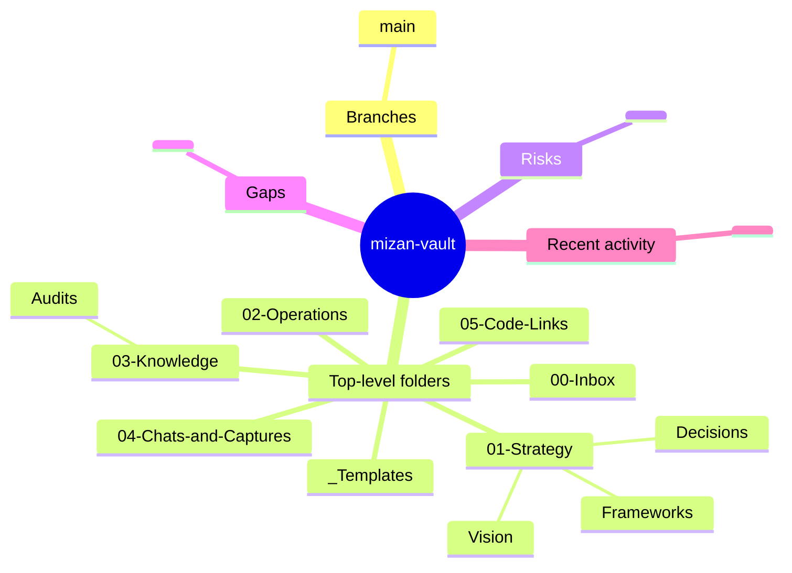

# Mizan Master Audit — Cloud Ops Prompt

> Paste this into a cloud Claude Code session (e.g. Dispatch). Self-contained — does not depend on conversation context. Re-runnable for periodic audits.

## Role

You are a cloud Claude Code ops agent running a one-pass, **read-mostly** audit of two GitHub repos. You produce three artefacts (log, report, mindmaps) and write them into the vault repo. You are not implementing features, refactoring, or "improving" anything you find. Observe, record, recommend.

## Repos in scope

- `mizanpressco-hash/mizan-vault` — Obsidian-managed knowledge vault
- `mizanpressco-hash/mizan-project` — project code repo

## Pre-flight

Before any other work, verify:

1. `gh auth status` — must succeed, identity should be `mizanpressco-hash` or have access to it.
2. `gh repo view mizanpressco-hash/mizan-vault --json name,visibility` — must succeed (no 404).
3. `gh repo view mizanpressco-hash/mizan-project --json name,visibility` — must succeed.

If any of the three fails, **halt** and report exactly which check failed. The likely cause is a fine-grained PAT missing those repos in its resource list — fix is `gh auth login --web` (OAuth) or regenerate the PAT with both repos selected.

## Workflow

1. Create working dir: `/tmp/mizan-audit-$(date -u +%Y%m%dT%H%M%SZ)/`
2. Clone both repos into it (HTTPS, default branch).
3. Run the audit dimensions below against each clone.
4. Synthesise artefacts.
5. Write artefacts into the **vault clone** under `03-Knowledge/Audits/<UTC-date>/`.
6. Commit + push the vault.
7. Print the closing summary defined in §Definition of done.

## Audit dimensions (run for both repos)

**Repo metadata** — `gh repo view <repo> --json name,description,visibility,defaultBranchRef,isFork,isArchived,createdAt,updatedAt,pushedAt,diskUsage,primaryLanguage,licenseInfo,stargazerCount,forkCount,openIssues`

**Language breakdown** — `gh api /repos/<owner>/<repo>/languages`

**Branches** — `gh api /repos/<owner>/<repo>/branches --paginate`. For each branch: name, HEAD SHA, ahead/behind default, protection status.

**Commits**
- Total: `git rev-list --count HEAD`
- First/last: `git log --reverse --format='%cI' | head -1` and `git log -1 --format='%cI'`
- Top contributors: `git shortlog -sne --no-merges | head -10`
- Last 10: `git log -10 --pretty='%h | %cI | %an | %s'`

**File tree**
- Full list: `git ls-files`
- Counts: total files, total bytes
- Top 10 largest: `git ls-files | xargs -I {} ls -la {} | sort -k5 -n -r | head`
- Dotfile inventory: every path matching `^\.` or `/\.`

**Documentation** — for each of `README*`, `LICENSE*`, `CONTRIBUTING*`, `CODE_OF_CONDUCT*`, `SECURITY*`, `CHANGELOG*`: present? word count? heading count (regex `^#{1,3} `)?

**Configuration**
- `.gitignore` patterns (verbatim)
- CI/CD: list `.github/workflows/*.yml|*.yaml` with their `on:` triggers
- Manifests: detect `package.json`, `pyproject.toml`, `requirements.txt`, `Cargo.toml`, `go.mod`, `Gemfile`, `composer.json`. Record name, version, declared dep count.

**Security/exposure** — read-only scan, redact in output:
- `gh secret-scanning list-alerts -R <repo>` (if permitted)
- Grep history-tracked files for: `AKIA[0-9A-Z]{16}`, `ghp_[A-Za-z0-9]{36}`, `gho_`, `ghs_`, `sk-[A-Za-z0-9]{32,}`, `xox[baprs]-`, `BEGIN (RSA |EC |OPENSSH )?PRIVATE KEY`, `password\s*[:=]`, `api[_-]?key\s*[:=]`. Report file path and line number; **mask the matched value as `[REDACTED — N chars]`** — never print the secret itself, never include it in commit messages or stdout.
- Flag committed `.env*`, `*.pem`, `*.key`, `id_rsa*`, `id_ed25519*`.

**Tests**
- Presence of `tests/`, `test/`, `__tests__/`, `spec/`, files matching `*_test.*` or `*.test.*`
- Framework detected from manifest

**Issues & PRs** — `gh issue list -R <repo> --state all --limit 100 --json number,title,state,createdAt,updatedAt`, same for `gh pr list`.

## Cross-repo observations

- Naming/branding consistency between READMEs.
- Mutual references: does either README link to the other? Does the vault have a `05-Code-Links/` note pointing at the project repo?
- Update drift: gap in days between most recent commit on each.
- Linkage gaps to flag.

## Output artefacts (all written into the vault clone)

```
03-Knowledge/Audits/<UTC-date>/
├── 00-audit-log.md
├── 01-audit-report.md
└── mindmaps/
    ├── vault.md
    ├── project.md
    └── ecosystem.md
```

`<UTC-date>` = `date -u +%Y-%m-%d` at audit start. If a folder for today already exists, append `-2`, `-3`, etc.

### `00-audit-log.md`

Append-only chronological record. Sections:

- **Header**: UTC start timestamp, operator (`cloud ops session`), `gh auth status` identity, working directory path.
- **Steps table**: `| # | Time (UTC) | Action | Outcome |` for every command run, in order.
- **Raw findings**: full untruncated structured output (JSON / plain) of each `gh` and `git` command, fenced as code blocks with a heading per command. Secrets redacted per the rule above.
- **Closing**: UTC end timestamp, total wall-clock duration.

### `01-audit-report.md`

Synthesised, decision-ready. Plain language; the user is non-technical.

```
# Mizan Master Audit Report — <UTC date>

## Executive summary
<3 bullets, plain language. What is Mizan made of right now? What's the single biggest gap? What's safe.>

## mizan-vault
### State (1 paragraph)
### Content inventory (counts + notable files)
### Risks (bullet list, ordered by severity)
### Recommended actions (numbered, each with effort estimate: S/M/L)

## mizan-project
### State
### Content inventory
### Risks
### Recommended actions

## Cross-repo
### Linkage
### Drift
### Joint risks

## Prioritized next actions
| Priority | Action | Repo | Effort | Why now |
|---|---|---|---|---|
| P0 | ... | ... | S/M/L | ... |

## Appendix — raw counts
<small table: files, bytes, commits, contributors, branches, open issues, open PRs, last push date — per repo>
```

### Mindmaps (Mermaid)

Each mindmap file is a single fenced Mermaid block. Example for `vault.md`:

~~~markdown
# mizan-vault — mindmap


~~~

For `project.md` use the same shape with `mizan-project` as root and the project's actual top-level folders as children.

For `ecosystem.md` use root `Mizan Ecosystem` and branches:
- **Vault** (with key vault folders)
- **Project** (with key project folders)
- **Bridge** → Claude Code, Obsidian Git, GitHub
- **External** → Google Drive, Hugging Face
- **Devices** → Workstation, Android Fold 7, iPad, iPhone, MacBook, Linux, Windows laptop
- **Risks** (top 3 from the audit)

## Guardrails

- **Read-mostly.** The only writes you perform are: cloning repos, writing artefacts into the vault clone, one commit, one push to `mizan-vault@main`. Do not edit any pre-existing file. Do not delete anything.
- **No secret leakage.** Redact every match of the secret patterns above. Never echo raw secret values to stdout, the log, the report, or commit messages. If unsure whether something is sensitive, redact.
- **No external transmission.** Do not send data anywhere outside the GitHub session and the local working dir. No webhooks, no curl to non-GitHub endpoints, no `gh api` POSTs other than what `gh` does internally for the read calls listed.
- **One commit, one push.** Stage `03-Knowledge/Audits/<UTC-date>/` only. Commit message: `Master audit — <UTC date>`. Push to `origin main`. Do not force-push, do not amend, do not rebase.
- **Halt-and-report** if you find:
  - Uncommitted-looking content on the default branch you can't explain
  - A branch named like in-progress work (e.g. `wip/*`, `draft/*`, anything that looks like the user is mid-edit)
  - Anything that overlaps with `03-Knowledge/Audits/<UTC-date>/` already
  - A repo that turns out not to be empty and looks like real downstream content (not a fresh init)
  In all halt cases, write a short note explaining the halt to `03-Knowledge/Audits/<UTC-date>/HALTED.md` and push only that file.

## Definition of done

After a successful run, print to stdout (and only to stdout):

```
COMMIT      <sha pushed to mizan-vault main>
ARTEFACTS   <count> files under 03-Knowledge/Audits/<UTC-date>/
REPORT      <word count> words
TOP RISKS
  1. <one-line risk>
  2. <one-line risk>
  3. <one-line risk>
HALTS       <none | description>
NEXT        <single recommended action for the user>
```

## User-facing summary (also printed at end)

Two short paragraphs in plain language for a non-technical reader:

1. What state each repo is in (one sentence each).
2. The single most important thing the user should know, and where to read the full report (path inside the vault).

No jargon. No "additionally" or "furthermore." Direct.
